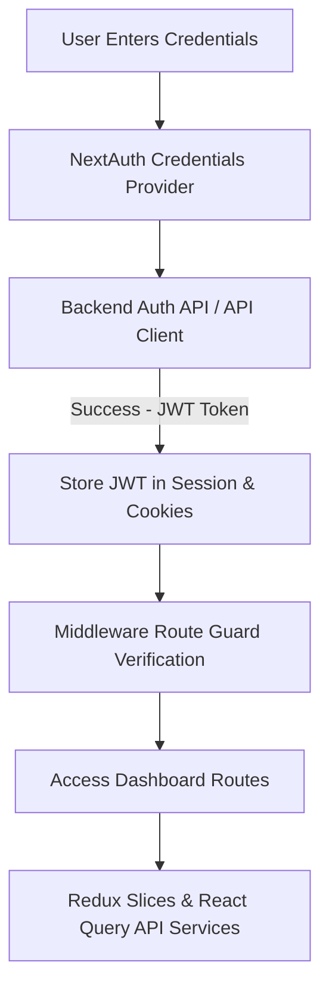

# SFA Frontend (`SFA - FE`) Codebase Architecture & Documentation

Welcome to the **Sales Force Automation (SFA) Frontend** repository documentation. This codebase is an enterprise-grade, high-performance web application built with **Next.js 14**, **React 18**, **TypeScript**, and **Material UI (MUI v5)** in a **PNPM Monorepo** structure.

---

## 📐 Monorepo Architecture Overview

The repository is configured as a **pnpm workspace** (`pnpm-workspace.yaml`) containing two core packages:

```
SFA - FE/
├── pnpm-workspace.yaml
├── package.json
├── packages/
│   ├── api/                      # Auto-generated OpenAPI TypeScript API Client
│   └── connect-force/            # Core Next.js 14 Enterprise Web Application
```

### 1. `packages/api` (`connect-force-api-client`)
- **Purpose**: Strongly typed REST API client generated from backend OpenAPI/Swagger specifications.
- **Tech Stack**: TypeScript, Axios.
- **Features**: Maps backend endpoints and data transfer objects (DTOs) directly to TypeScript interfaces for full compile-time safety across frontend API interactions.

### 2. `packages/connect-force` (`connect-force`)
- **Purpose**: Primary web application portal for administrators, managers, and field supervisors.
- **Tech Stack**: Next.js 14 (App Router), React 18, Redux Toolkit, React Query, Material UI v5.

---

## 🛠️ Technology Stack & Key Dependencies

| Domain | Technology / Library | Description |
| :--- | :--- | :--- |
| **Framework** | Next.js `14.0.4` | App Router architecture with Server and Client Components |
| **Language** | TypeScript `^5.6.2` | Strong static typing throughout the app |
| **UI Design System** | Material UI (MUI v5) `^5.16.7` | Standardized component library (`@mui/material`, `@mui/x-data-grid`, `@mui/lab`) |
| **Styling & Animation** | Emotion, Styled Components, Framer Motion | Dynamic theme engine, glassmorphic styling, and micro-interactions |
| **State Management** | Redux Toolkit `^2.2.7`, Redux Persist | Centralized state store with persistence across page reloads |
| **Data Fetching** | React Query `^3.39.3`, Axios `^1.7.7` | Asynchronous cache management and REST API orchestration |
| **Authentication** | NextAuth.js `^4.24.8` | Session management, JWT integration, and security route middleware |
| **Form Handling** | React Hook Form `^7.53.0`, Yup `^1.4.0` | High-performance form state management and schema validation |
| **Custom UI Packages** | `@icp/react-crystals`, `@icp/react-fusion` | Custom enterprise UI components bundled in vendor packages |
| **Charts & Data Export** | ApexCharts, `@react-pdf/renderer`, XLSX | Business analytics charts, PDF generation, and Excel/CSV exporting |

---

## 📂 Directory & Folder Structure (`packages/connect-force`)

```
packages/connect-force/
├── app/                          # Next.js 14 App Router Directory
│   ├── api/                      # Next.js API Routes (NextAuth handler, cookie clear)
│   ├── auth/                     # Authentication screens (Login, Change/Forgot Password, Access Denied)
│   ├── dashboard/                # Main Enterprise SFA Dashboard (50+ Business Feature Modules)
│   └── layout.tsx                # App Root Layout & Global Context Providers
├── auth/                         # NextAuth Configuration & Guards
├── service/                      # Modular API Service Abstractions (Axios integration)
├── redux/                        # Redux Store Configuration & Slices
│   ├── store.tsx                 # Redux Store Initialization & Persistence
│   ├── rootReducer.tsx           # Combined Root Reducers
│   └── slices/                   # 48+ Modular Redux Slices
├── components/                   # Reusable UI Components (Tables, Modals, Forms, Navigation)
├── layout/                       # Dashboard Page Layouts, Sidebars, and Headers
├── theme/                        # MUI Custom Theme Definitions & Palette Configurations
├── types/                        # TypeScript Interfaces & Type Declarations
├── utils/                        # Helper Utilities, Formatters, & Export Functions
├── vendor/                       # Custom Vendor Packages (`icp-react-crystals`, `icp-react-fusion`)
└── middleware.ts                 # Next.js Route Guard & Authentication Middleware
```

---

## 📊 Core Business Modules Breakdown (`app/dashboard/*`)

The frontend application provides comprehensive administration and operational workflows across 50+ domain modules:

### 1. 🏢 Master Data & Entity Management
- **Companies & Distributors**: `manage-company`, `manage-distributors`, `distributor-accounts`
- **Outlets**: `manage-outlets`, `main-outlet`, `outlet-category`, `outlet-classification`, `outlet-states`, `outlet-transfer`
- **Business Structure**: `business-category`, `legal-entity-type`

### 2. 📦 Product & Pricing Engine
- **Products**: `manage-products`, `product-category`, `product-group`, `uom`, `sales-unit-type`
- **Pricing & Discounts**: `price-list`, `price-list-type`, `price-type`, `discount`

### 3. 🎯 Sales Operations & Field Management
- **Tours & Field Operations**: `sales-tour`, `direct-sale-tour`, `rep-tour`, `route`
- **Representatives**: `sales-representative`, `user-role-assignment`, `user-role-permission`
- **Inventory & Stock**: `inventory`

### 4. 🏷️ Asset Management
- **Asset Tracking**: `asset`, `asset-allocation`, `asset-brand`, `asset-model`, `asset-transfer`, `asset-type`

### 5. 🚚 Logistics & Warehousing
- **Vehicles**: `vehicle`, `vehicle-category`
- **Warehouses**: `warehouse`, `warehouse-category`, `warehouse-type`

### 6. 💳 Financials & Reasons
- **Payments**: `payment`, `payment-mode`, `payment-term`
- **Reasons & Delivery**: `delivery-method`, `lost-callReason`, `return-reason`, `unloading-reason`

### 7. 📈 Analytics & Reporting
- **Dashboards**: `dashboard-screen`, `report`

---

## 🔐 Authentication & State Flow



---

## 🚀 Local Development Setup

### Prerequisites
- **Node.js**: `v18.x` or `v20.x`
- **pnpm**: `v8.x` or `v9.x` (`npm i -g pnpm`)

### Installation & Run Steps

1. **Clone & Install Dependencies**:
   ```bash
   pnpm install
   ```

2. **Configure Environment Variables**:
   Copy `.env.example` to `.env` in `packages/connect-force`:
   ```ini
   NEXTAUTH_URL=http://localhost:3000
   NEXTAUTH_SECRET=your-nextauth-secret-key
   NEXT_PUBLIC_API_BASE_URL=http://localhost:8081/api
   ```

3. **Start Development Server**:
   ```bash
   pnpm dev
   ```
   *The application will launch on [http://localhost:3000](http://localhost:3000)*

4. **Build Production Bundle**:
   ```bash
   pnpm build
   ```

---

## 🐳 Docker & CI/CD Deployment

### Local Docker Build
```bash
docker build -t sfa/frontend --build-arg API_URL=http://192.168.100.18:8081/api .
docker run -p 3000:3000 sfa/frontend:latest
```

### Azure Pipelines CI/CD
- **Dev Pipeline**: `SFA-FE-pipeline-Dev-build.yml`
- **Prod Pipeline**: `SFA-FE-pipeline-Prod-build.yml`
- Triggers automatically on version tag pushes (`v*.*.*`).
